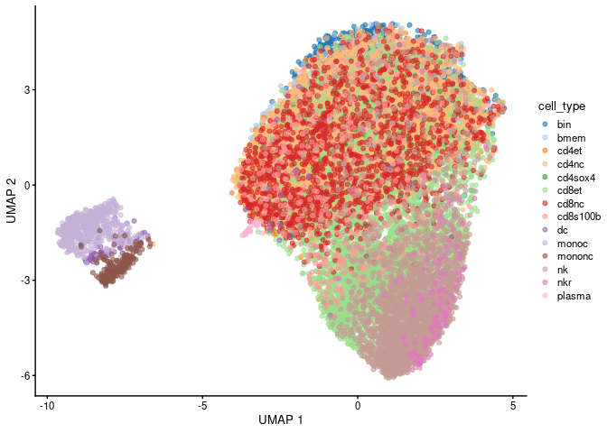

<!-- README.md is generated from README.Rmd. Please edit that file -->

# scDesignPop

<!-- badges: start -->
<!-- badges: end -->

scDesignPop is a simulator for population-scale single-cell
RNA-sequencing (scRNA-seq) data.

## Installation

You can install the development version of scDesignPop from
[GitHub](https://github.com) with:

``` r
# install.packages("remotes")
remotes::install_github("chrisycd/scDesignPop")
```

## Running scDesignPop

This is an example showing how to run scDesignPop in several sequential
steps:

## Step 1: construct a data list

The `eqtlgeno` dataframe consists of eQTL annotations and genotypes for
SNPs across individuals (samples). First a list of components needed to
run scDesignPop is required. This can be done by using the
`constructDataPop` function.

``` r
library(scDesignPop)
library(SingleCellExperiment)
library(SummarizedExperiment)
library(scater)

data("example_eqtlgeno")
data("example_sce")

head(example_eqtlgeno)
#>   cell_type         gene_id      snp_id CHR       POS indiv1 indiv2 indiv3
#> 1     cd4nc ENSG00000023902 1:150133323   1 150133323      0      1      0
#> 2     cd8nc ENSG00000023902 1:150159616   1 150159616      2      2      2
#> 3     cd4nc ENSG00000028137  1:12192270   1  12192270      2      0      2
#> 4     cd8nc ENSG00000028137  1:12267999   1  12267999      1      0      1
#> 5        nk ENSG00000028137  1:12267999   1  12267999      2      0      2
#> 6     cd4et ENSG00000049247   1:8175947   1   8175947      1      1      1
#>   indiv4 indiv5 indiv6 indiv7 indiv8 indiv9 indiv10 indiv11 indiv12 indiv13
#> 1      1      1      0      0      1      0       0       1       0       1
#> 2      1      2      1      1      2      2       2       1       2       2
#> 3      2      2      1      2      2      2       2       2       2       2
#> 4      1      1      1      0      0      1       1       1       1       1
#> 5      1      1      1      1      0      1       1       0       2       0
#> 6      0      1      0      1      1      2       1       1       0       2
#>   indiv14 indiv15 indiv16 indiv17 indiv18 indiv19 indiv20
#> 1       0       0       1       0       0       0       1
#> 2       1       1       2       2       1       2       2
#> 3       1       2       1       2       2       1       1
#> 4       0       1       1       2       0       1       2
#> 5       1       0       0       2       0       1       0
#> 6       1       1       0       1       2       0       2
```

``` r

data_list <- constructDataPop(
    sce = example_sce,
    eqtlgeno_df = example_eqtlgeno,
    new_covariate = as.data.frame(SingleCellExperiment::colData(example_sce)),
    overlap_features = NULL,
    sampid_vec = NULL,
    ct_copula = TRUE,
    slot_name = "counts",
    snp_model = "single",
    cellstate_colname = "cell_type",
    feature_colname = "gene_id",
    snp_colname = "snp_id",
    loc_colname = "POS",
    chrom_colname = "CHR",
    indiv_colname = "indiv",
    prune_thres = 0.9
    )
```

## Step 2: fit marginal model

Next, a marginal model is specified and fit using the `fitMarginalPop`
function.

``` r
marginal_list <- fitMarginalPop(
    data_list = data_list,
    mean_formula = "(1|indiv) + cell_type",
    model_family = "nb",
    interact_colnames = NULL,
    parallelization = "pbmcapply",
    n_threads = 50L,
    loc_colname = "POS",
    snp_colname = "snp_id",
    cellstate_colname = "cell_type",
    indiv_colname = "indiv",
    filter_snps = TRUE,
    snpvar_thres = 0,
    force_formula = FALSE,
    data_maxsize = 1
    )
```

## Step 3: fit a Gaussian copula

The third step is to fit a Gaussian copula using the `fitCopulaPop`
function.

``` r
set.seed(123, kind = "L'Ecuyer-CMRG")

copula_fit <- fitCopulaPop(
    sce = example_sce,
    assay_use = "counts",
    input_data = data_list[["new_covariate"]],
    marginal_list = marginal_list,
    family_use = "nb",
    copula = "gaussian",
    n_cores = 6L,
    parallelization = "mcmapply"
    )
#> Convert Residuals to Multivariate Gaussian
#> Converting End
#> Copula group 1 starts
#> Copula group 2 starts
#> Copula group 3 starts
#> Copula group 4 starts
#> Copula group 5 starts
#> Copula group 6 starts
#> Copula group 7 starts
#> Copula group 8 starts
#> Copula group 9 starts
#> Copula group 10 starts
#> Copula group 11 starts
#> Copula group 12 starts
#> Copula group 13 starts
#> Copula group 14 starts
```

``` r

RNGkind("Mersenne-Twister")  # reset to default
```

## Step 4: extract parameters

The fourth step is to compute the mean, sigma, and zero probability
parameters using the `extractParaPop` function.

``` r
para_new <- extractParaPop(
    sce = example_sce,
    assay_use = "counts",
    marginal_list = marginal_list,
    n_cores = 6L,
    family_use = "nb",
    new_covariate = data_list[["new_covariate"]],
    new_eqtl_geno_list = data_list[["eqtl_geno_list"]],
    data = data_list[["covariate"]],
    parallelization = "pbmcmapply"
    )
```

## Step 5: simulate counts

The fifth step is to simulate counts using the `simuNewPop` function.

``` r
set.seed(123)

newcount_mat <- simuNewPop(
    sce = example_sce,
    mean_mat = para_new[["mean_mat"]],
    sigma_mat = para_new[["sigma_mat"]],
    zero_mat = para_new[["zero_mat"]],
    quantile_mat = NULL,
    copula_list = copula_fit[["copula_list"]],
    n_cores = 6L,
    family_use = "nb",
    nonnegative = TRUE,
    input_data = data_list[["covariate"]],
    new_covariate = data_list[["new_covariate"]],
    important_feature = copula_fit[["important_feature"]],
    filtered_gene = data_list[["filtered_gene"]],
    parallelization = "pbmcmapply"
    )
#> Use Copula to sample a multivariate quantile matrix
#> Sample Copula group 1 starts
#> Sample Copula group 2 starts
#> Sample Copula group 3 starts
#> Sample Copula group 4 starts
#> Sample Copula group 5 starts
#> Sample Copula group 6 starts
#> Sample Copula group 7 starts
#> Sample Copula group 8 starts
#> Sample Copula group 9 starts
#> Sample Copula group 10 starts
#> Sample Copula group 11 starts
#> Sample Copula group 12 starts
#> Sample Copula group 13 starts
#> Sample Copula group 14 starts
```

## Step 6: create SingleCellExperiment object using simulated data

After simulating the data, we can create a `SingleCellExperiment` object
as follows.

``` r
simu_sce <- SingleCellExperiment(list(counts = newcount_mat), 
                                 colData = data_list[["new_covariate"]])
names(assays(simu_sce)) <- "counts"

# save gene meta data
rowData(simu_sce) <- rowData(example_sce)
```

## Step 7: visualize using UMAP

The simulated data can be visualized using a UMAP plot as follows.

``` r
logcounts(simu_sce) <- log1p(counts(simu_sce))

simu_sce <- runPCA(simu_sce,
                   ncomponents = 30)  # default is 50

set.seed(123)
simu_sce <- runUMAP(simu_sce, dimred = "PCA", 
                            n_neighbors = 15,   # default
                            min_dist = 0.3,     # default
                            n_threads = 10L)

plotReducedDim(simu_sce, "UMAP", color_by = "cell_type")
```



## Step 8: power analysis

Lastly, scDesignPop can perform power analysis for a specific gene.
